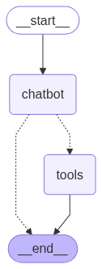

# LangGraph AI Agent with Human-in-the-Loop Integration

A comprehensive implementation of AI agents using LangGraph, featuring tool calling capabilities, conditional workflows, memory management, and human-in-the-loop decision making.

## 🎯 Project Overview

This project demonstrates the progressive development of AI agents using LangGraph, starting from simple graph structures to complex agents with human oversight. The implementation showcases various LangGraph features including:

- **Graph-based agent workflows**
- **Tool integration and function calling**
- **Conditional routing and decision making**
- **Memory and state management**
- **Human-in-the-loop interactions**
- **LangSmith tracing for debugging**

## Key Features

### 1. **Progressive Learning Path**
The notebooks are structured to progressively introduce LangGraph concepts:
- Start with simple graph construction
- Add conditional logic
- Implement chatbot functionality
- Integrate external tools
- Build complete agents with memory
- Add human oversight capabilities

### 2. **Tool Integration Architecture**

The project implements two main workflow patterns for tool integration:

#### Basic Tool Call Pattern


This pattern demonstrates:
- Linear flow from start to end
- Chatbot node that can branch to tools
- Tools return results back to the workflow
- Clean termination at the end node

#### Advanced Agent with Memory Pattern


This enhanced workflow features:
- Circular flow enabling multiple tool calls
- Bidirectional communication between chatbot and tools
- Memory integration for maintaining conversation context
- Persistent state across multiple interactions

### 3. **Human-in-the-Loop Decision Making**

The crown jewel of this project is the implementation of human oversight in AI decision-making. The stock trading agent demonstrates real-world safety mechanisms:

#### Example: Stock Purchase with Human Approval

**Scenario 1: User Approves Transaction**
```
The current price of one MSFT stock is $200.3. 
Therefore, the current price of 10 MSFT stocks is $2003.

[Interrupt(value='Approve buying 10 MSFT stocks for $2003.00?', 
          id='d095282c5a4f5219f1d5424735a70807')]

Approve (yes/no): yes

OK. You bought 10 shares of MSFT for a total price of $2003.0.
```

**Scenario 2: User Rejects Transaction**
```
The current price for one MSFT stock is $200.3. 
Therefore, the current price for 10 MSFT stocks is $2003.0.

[Interrupt(value='Approve buying 10 MSFT stocks for $2003.00?', 
          id='bb1304a53ca1233dec2f6c0c1a2c8a2d')]

Approve (yes/no): no

I am sorry, I was not able to buy the stocks. The transaction was declined.
```

### 4. **Implementation Highlights**

- **Interrupt Mechanism**: The agent pauses execution at critical decision points
- **User Control**: Complete control over high-stakes decisions
- **Graceful Handling**: Both approval and rejection paths are handled elegantly
- **Transaction Safety**: No action is taken without explicit user consent
- **Clear Communication**: The agent provides context before requesting approval

### 5. **State Management**
- Implements graph state for maintaining conversation context
- Memory integration for multi-turn interactions
- State persistence across workflow nodes
- Seamless handling of user inputs and system responses

### 6. **LangSmith Integration**
The project includes comprehensive tracing capabilities:
- Visualize agent execution paths
- Monitor tool calls and responses
- Debug decision points
- Analyze conversation flows

## Use Cases

This implementation pattern is ideal for:
- **Financial Applications**: Trading, investments, transactions requiring approval
- **Healthcare Systems**: Treatment recommendations with doctor oversight
- **Legal Tech**: Contract reviews with lawyer validation
- **Customer Service**: High-value customer decisions with manager approval
- **Autonomous Systems**: Any AI system where human judgment is critical

## Technical Innovation

The project showcases several technical innovations:
1. **Interrupt-based Control Flow**: Novel approach to pausing agent execution
2. **State Preservation**: Maintaining context across human interruptions
3. **Flexible Routing**: Dynamic path selection based on human input
4. **Error Resilience**: Graceful handling of rejection scenarios

## Project Impact

This implementation demonstrates how to build AI systems that are:
- **Safe**: Critical decisions require human approval
- **Transparent**: Users understand what the AI intends to do
- **Controllable**: Humans maintain ultimate decision authority
- **Practical**: Real-world applicability for high-stakes scenarios

## Contributing

Contributions are welcome! Please feel free to submit a Pull Request. For major changes, please open an issue first to discuss what you would like to change.

## License

This project is licensed under the MIT License - see the LICENSE file for details.

## Acknowledgments

- Built with [LangGraph](https://github.com/langchain-ai/langgraph) by LangChain
- Powered by OpenAI's language models
- Debugging supported by LangSmith

## Contact

- GitHub: [@Sharvil24](https://github.com/Sharvil24)
- Email: sharvilwadekar@gmail.com

---

**Note**: This project is for educational purposes and demonstrates various LangGraph capabilities. Always ensure proper security measures when dealing with financial transactions in production environments.